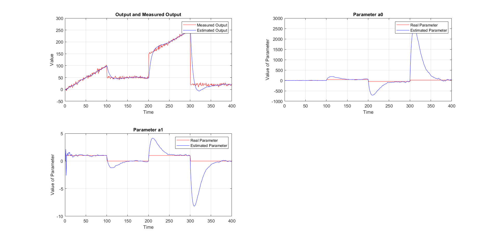

## Comparison of C++ algorithm results:

To reliably compare the results of the C++ algorithm, use was made of the 
implented *recursiveLS* algorithm in MATLAB. The comparison was made for the same
output and with the purpose of estimating a 1st order and a 2nd order polynomial, 
using a forgetting factor equal to 0.9.

The output is as follows:
For 0 <= x < 100: f(x) = x

For 100 <= x < 200: f(x) = 50

For 200 <= x < 300: f(x) = x - 50 

For 300 <= x < 400: f(x) = 20

For the 1st order polynomial estimation, the MATLAB algorithm presented the following results:

The C++ algorithm presented the following:

As we can see, the noise that was added to the signals creates slight deviations
from the desired output, however the two proccesses present very similar results.

For the 2nd order polynomial estimation, 50 more samples of a 2nd order function
were added to the output signal:

For 400 <= x < 500:
f(x) = 0.4 * (x - 398)^2 - 2 * (x - 398) + 1

For the estimation, the MATLAB algorithm presented the following results:

The C++ algorithm presented the following:

We can notice that, again, the two processes are very similar with one another and that at the points of change the parameters
have very large variations and that it also takes some time before the output convergers to the desired result. 

The matrices required for the MATLAB process are in .mat form in the folder MAT_Files and were 
created using MATLAB.

The matrices required for the C++ process are in .txt form in the Folder TXT_Files and were 
created using C++ and then loaded in MATLAB for presentation.

The images can be found in the image folder. The MATLAB images were created from the Test2.m and Test3.m respectively
and the C++ image from the Graph.m code. All the .m files are in the code folder in the repository.