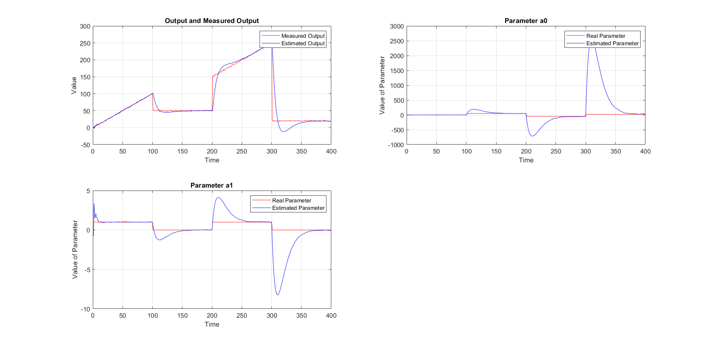
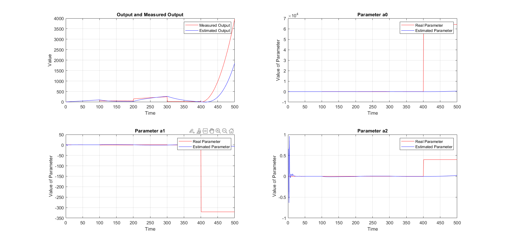
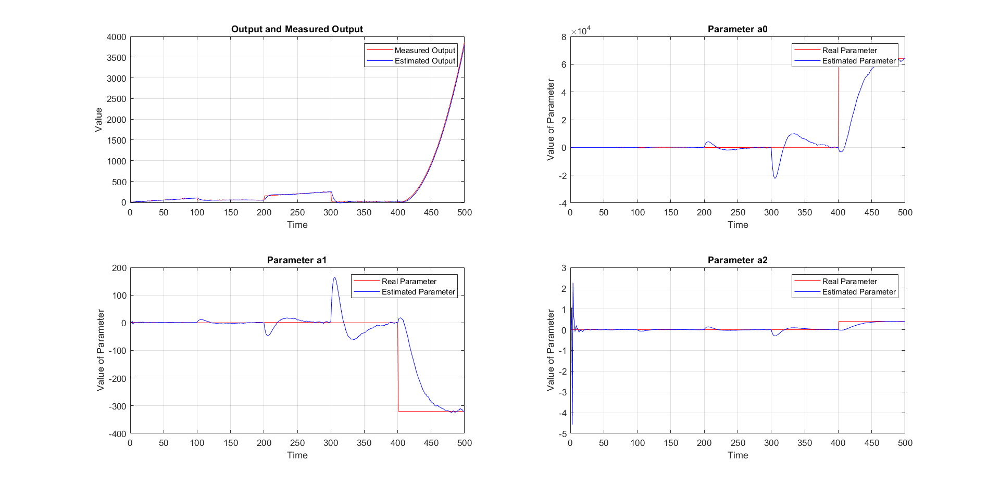

Διαδικασία σύγκρισης αποτελεσμάτων:
Για την σύγκριση των αποτελεσμάτων του υλοποιημένου σε C++ αλγορίθμου,
χρησιμοποιήθηκε η έτοιμη ρουτίνα της MATLAB *recursiveLS*. Η σύγκριση έγινε 
για την ίδια είσοδο σε προσέγγιση πολυωνύμου 1ου και 2ου βάθμου,με forgetting
factor 0.9.

Η έξοδος ορίστηκε ως εξής:
Για 0 <= x < 100:
f(x) = x

Για 100 <= x < 200:
f(x) = 50

Για 200 <= x < 300:
f(x) = x - 50 

Για 300 <= x < 400:
f(x) = 20

Για το πρώτου βαθμού πολυωνύμο, ο αλγόριθμος της MATLAB παρουσίασε τα παρακάτω αποτελέσματα:

Ο αλγόριθμος της C++ παρουσίασε τα παρακάτω:

Παρατηρείται ότι ο θόρυβος δημιουργεί αποκλίσεις στην προσέγγιση των παραμέτρων 
,αλλά οι δύο διαδικασίες παρουσιάζουν παρόμοια αποτελέσματα.

Για την διαδικασία εύρεσης των παραμέτρων του τρίτου βαθμού πολυωνύμου,
προστέθηκαν 50 δείγματα μια δευτεροβάθμιας συνάρτησης, δηλαδή:

Για 400 <= x < 500:
f(x) = 0.4 * (x - 398)^2 - 2 * (x - 398) + 1

Για το δεύτερου βαθμού πολυωνύμο, ο αλγόριθμος της MATLAB παρουσίασε τα παρακάτω αποτελέσματα:

Ο αλγόριθμος της C++ παρουσίασε τα παρακάτω:

Παρατηρούμε ίδια συμπεριφορά, και επίσης παρατηρούμε ότι στα σημέια αλλαγής των συναρτήσεων της εισόδου υπάρχει απότομη μεταβολή των παραμέτρων