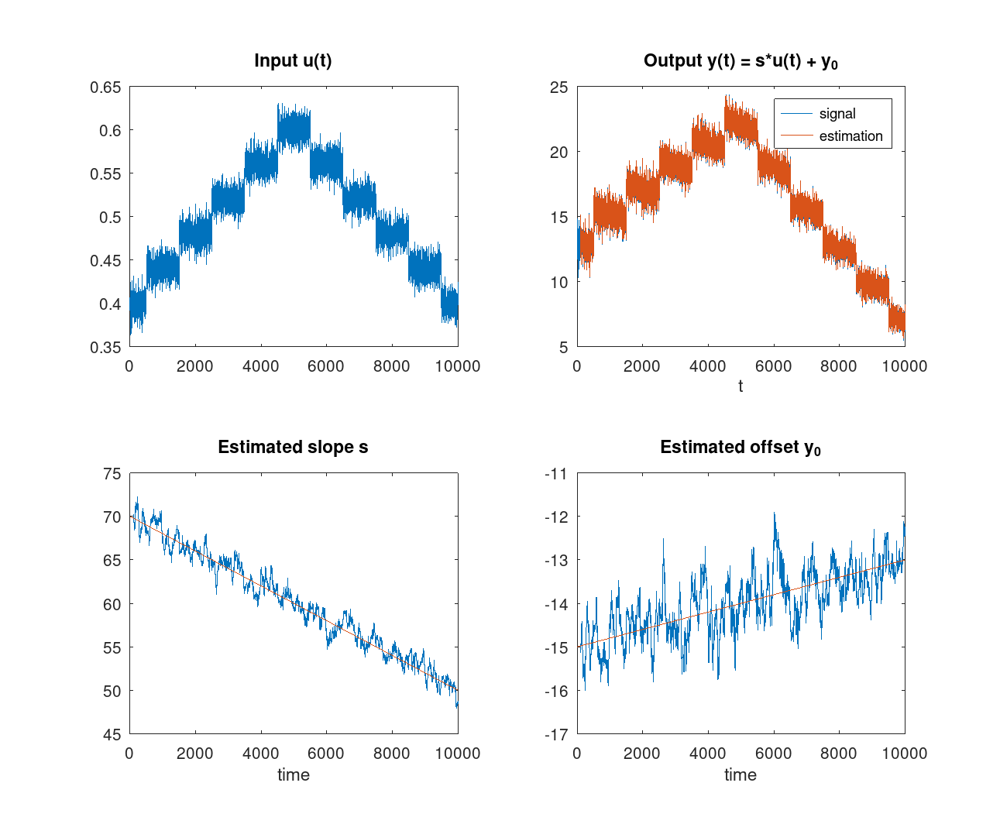
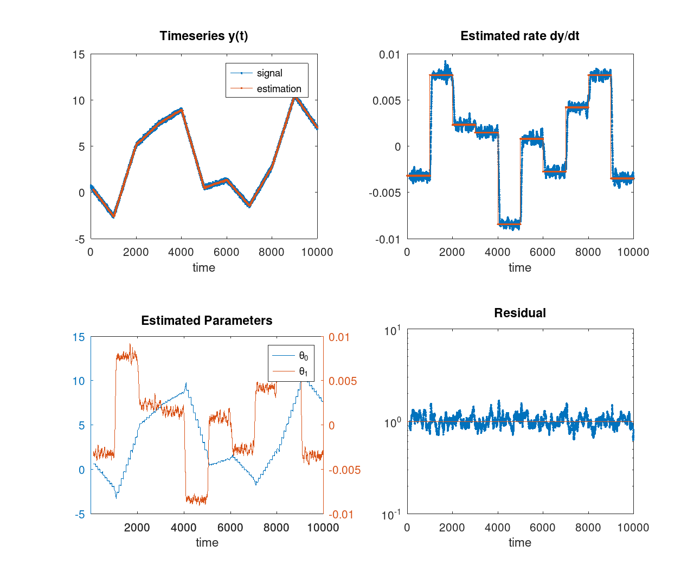

# RLS

Recursive least squares in C++

## About

Recursive least squares (RLS) refers to algorithms that recursively find the coefficients that minimize a weighted linear least squares cost function. 

It is assumed that a measured time-dependent quantity $y(t)$ follows a linear model plus noise

$$ y(t) = \theta^T \cdot \phi(t) + e(t) $$

where $\theta$ is a parameter vector, $\phi(t)$ is a vector of known functions of time and $e(t)$ is white noise, $\langle e(t) \rangle = 0$, $\langle e(t)e(t') \rangle = \sigma^2\delta(t-t')$.

A least squares cost function is defined as

$$ J(\theta) = \sum_t {w(t) \left[ y(t) - \theta^T \cdot \phi(t) \right]^2} $$

where $w(t)$ is a weighting function.

RLS algorithms seek to estimate $\theta$ that minimizes $J$ and recursively refine this estimation as new data become available. This is acheived with a very elegant numerical technique which is given here very briefly. 

The solution of the least squares problem (for $w(t)=1$) is given by the normal equations

$$ \left[ \Phi^T \cdot \Phi \right] \theta = A\cdot \theta = \Phi^T\cdot Y \rightarrow \theta = A^{-1}\cdot \Phi^T\cdot Y$$

where $\Phi = [\phi(1) \; \phi(2) \dots ]^T$, $Y = [y(1) \; y(2) \dots ]^T$

When a new data point becomes available the matrix $A$ is modified as

$$ A' = A + \phi \cdot \phi^T $$
 
 The inverse of $A'$, $P'=A'^{-1}$  can be obtained from $P=A^{-1}$ using the **Wilkinson** matrix formula:

 $$ P' = (A + \phi \cdot \phi^T)^{-1} = P - \frac{P\cdot\phi\cdot\phi^T\cdot P}{1 + \phi^T\cdot P\cdot \phi} $$

 Thus, in RLS algorithms we keep a copy of $P$ which is updated by the above formula. Note that $P$ is the covariance matrix of $\theta$.

 The parameters are updated by 

$$ e(t) = y(t) - \theta^T(t-1)\cdot \phi(t) $$

$$ \theta' = \theta + k\, e(t) $$

where $k$ is the "gain" which is defined below.

## Examples

1. A system with input $u(t)$ and output $y(t)=s\cdot u(t) + y_0$, where $s$ and $y_0$ vary with time. RLS is used to obtain an estimate of $s$ and $y_0$.


2. A timeseries $y(t)$ is fitted with a polynomial $f(t;\theta)=\theta_0 + \theta_1\cdot t$ to estimate the time-dependent parameters $(\theta_0,\theta_1)$ and thus obtain the derivative $dy/dt$



## Implemented Algorithms

### 1. Exponentially weighted RLS

In this algorithm the weighting function is

$$ w(t) = \lambda ^ {n-t}, \quad t\leq n$$

where $0 < \lambda \leq 1$ is the "forgetting factor". The data are exponentially weighted so that older data are "forgotten". The effective   forgetting time constant $\tau$ can be found from

$$ \lambda = e^{-1/\tau} \approx 1 - 1/\tau $$

The recursion is given by

> $$ e(t) = y(t) - \theta^T(t-1)\cdot \phi(t) $$
> $$ u = P(t-1)\cdot \phi(t) $$
> $$ k = u / \left[ \lambda + \phi^T(t)\cdot u\right] $$
> $$ \theta(t) = \theta(t-1) + k\, e(t) $$
> $$ P(t) = \left[P(t-1) - k \cdot u^T\right]/\lambda $$
> $$ J(t) = \lambda J(t-1) + e^2(t) $$

The algorithm is still valid for $\lambda=1$ but with infinite memory length ($\tau \to \infty$)

### 2. Exponentially weighted RLS with square-root algorithm

The square root algorithm (initially due to Potter (1963)) utilizes the fact that $A$ and $P$ are symmetric, positive definite matrices. This can be understood e.g. by the fact that $J(\theta)$ close to the minimum can be expanded to 2nd order in $\theta - \theta_0$
$$ J = J_0 + (\theta - \theta_0)^{T} P^{-1} (\theta - \theta_0) $$
thus the matrix $A=P^{-1}$ (and $P$) must be positive definite so that there is a minimum.

Such matrices can be written as $P=Q\cdot Q^T$ where $Q$ is called the square root of $P$ (thus the name of the algorithm).
The covariance update can be turned into an update of $Q$:

$$ P' = Q'\cdot Q'^T = Q\left[ I - \beta u\cdot u^T \right] Q^T$$

where $u=Q^T \cdot\phi$ and $\beta = (1 + u^T\cdot u )^{-1}$.

It can be easily shown that

$$ \left[ I - \beta u\cdot u^T \right]  = \left[ I - \alpha u\cdot u^T \right]^2 $$

with $\alpha = \beta / \left[ 1 + \sqrt{1 - \beta u^T\cdot u}\right]$. Finally

$$ Q' = Q \left[ I - \alpha u\cdot u^T \right]$$

The benefit of $Q$ updating is that it ensures that $P$ retains its positive-definetness.

The RLS with recursion for $Q$ becomes

> $$ e(t) = y(t) - \theta^T(t-1)\cdot \phi(t) $$
>
> $$ u = Q^T(t-1) \cdot \phi(t) $$
>
> $$ \beta = \lambda + u^T \cdot u $$
>
> $$ \alpha = 1 / \left[\beta + \sqrt{\beta\,\lambda}\right] $$
>
> $$ k = Q(t-1) \cdot u $$
>
> $$ \theta(t) = \theta(t-1) + k \, [e(t)/\beta] $$
>
> $$ Q(t) = \left[Q(t-1) - \alpha \, k \cdot u^T\right]/\sqrt{\lambda} $$
>
> $$ J(t) = \lambda J(t-1) + e^2(t) $$

This algorithm is taken from Ljung & Soederstroem (1987) "Theory & Practice of Recursive Identification", p. 328

### 3. Block RLS

The rectangular moving block RLS uses the last $N$ points to estimate the parameters.
In each recursion the estimate is first *updated* with the new data point and then *downdated* by removing the oldest point.

The updating sequence is given by

> $$ e(t) = y(t) - \theta^T(t-1)\cdot \phi(t) $$
> 
> $$ u = P(t-1)\cdot \phi(t) $$
> 
> $$ \beta = \left[ 1 + \phi(t)^T \cdot u \right]^{-1} $$
> 
> $$ k = \beta \, u $$
> 
> $$ \bar{\theta}(t) = \theta(t-1) + k\, e(t) $$
> 
> $$ \bar{P}(t) = \left[P(t-1) - k \cdot u^T \right] $$
> 
> $$ e'(t) = y(t) - \theta(t)^T \cdot \phi(t) $$
> 
> $$ \bar{J}(t) = J(t-1) + e^2(t) \, \beta\,(1-\beta) + e'^2(t) $$
> 

The down-dating sequence is

> $$ e(t-N) = y(t-N) - \bar{\theta}^T(t)\cdot \phi(t-N) $$
> 
> $$ u = \bar{P}(t)\cdot \phi(t-N) $$
> 
> $$ \beta = \left[ 1 - \phi(t-N)^T \cdot u \right]^{-1} $$
> 
> $$ k = \beta \, u $$
> 
> $$ \theta(t) = \bar{\theta}(t) - k \, e(t-N) $$
> 
> $$ P(t) = \left[\bar{P}(t) + k \cdot u^T\right] $$
> 
> $$ e'(t-N) = y(t) - \theta(t)^T\cdot \phi(t-N) $$
> 
> $$ J(t) = \bar{J}(t) - e^2(t-N) \, \beta\,(1-\beta) - e'^2(t-N) $$
> 

### 4. Block RLS with square root update

Similar to the above, the block RLS algorithm can be formulated with update of the square root of $P$.

## Getting started

The algorithms are organized in a number of templated objects which are defined in 2 header files:
- [RLS.h](./source/RLS.h) defines the RLS algorithms
- [PolyRLS.h](./source/PolyRLS.h) defines the PolyRLS object for fitting timeseries with polynomials

In the ``filter'' folder there are 2 command line applications which can be used for testing and show most of the library features. More details can be found in the relevant [README](./filter/README.md).

The project can be built with cmake using the following commands:
```
> mkdir .build
> cd .build
> cmake ..
> make / nmake
```


## TODO

- Implement the $U D U^T$ factorization of covariance matrix and the updating algorithm by Bierman (1977)
- Document the C++ classes

## Contributors

- @nickspanos
  -  Initial implementation of the algorithms
- @MatinaDt
  - Implemented the use of Eigen library 
  - Tested Cholesky decomposition methods


