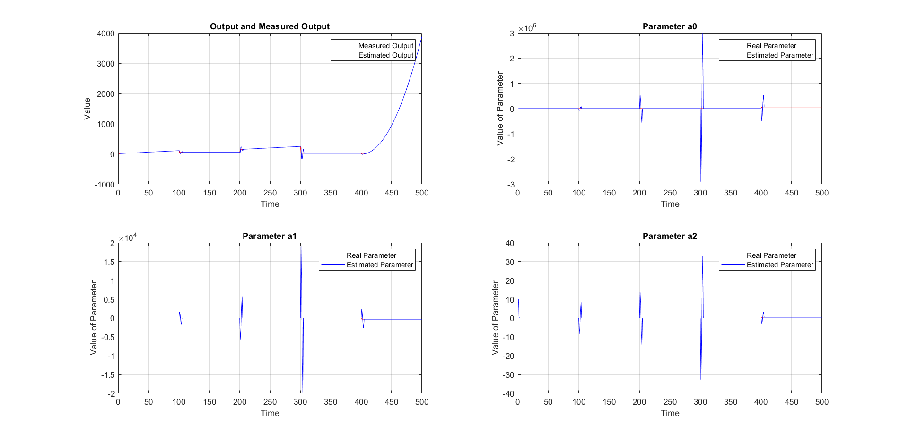
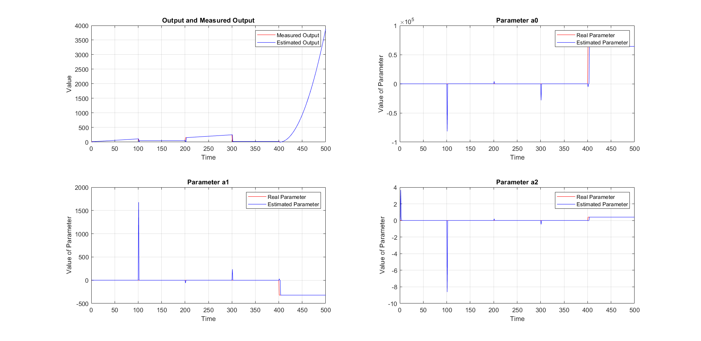

# Comparison of C++ algorithm results:
## Rectangular (Estimating a Polynomial)
To reliably compare the results of the C++ algorithm, use was made of the 
implented *recursiveLS* algorithm in MATLAB. The comparison was made for the same
output and with the purpose of estimating a 1st order and a 2nd order polynomial, 
using a forgetting factor equal to 0.9.

The output is as follows:
For $`0 <= x < 100: f(x) = x`$

For $`100 <= x < 200: f(x) = 50`$

For $`200 <= x < 300: f(x) = x - 50 `$

For $`300 <= x < 400: f(x) = 20`$

The *recursiveLS* function supports the rectangular window operation, meaning that only the N 
points of a specific window are taken into account for the parameter estimation. Thus, whenever a new
piece of data comes through and the window is "full", the first observation is removed. For the cross
referencing of the results, the same output and input as the exponential approach were used for 3 parameter estimation.

The MATLAB algorithm presented the following results:

The C++ algorithm presented the following:

The method is general is not every reliable and the parameters are not very well estimated. The C++ works similarly, however, to the implemented method in MATLAB. It has been noticed that for long periods in which the signal remains truthful to certain parameters, the parameters after a certain change will not 
be correctly estimated. It is probably required to reset the block to completely remove the influence of past points when large changes are detected.

The matrices required for the MATLAB process are in .mat form in the folder "MAT_Files" and were 
created using MATLAB.

The matrices required for the C++ process are in .txt form in the Folder "TXT_Files" and were 
created using C++ and then loaded in MATLAB for presentation.

The images can be found in the "images" folder. The MATLAB images were created from the "PolyTest2.m", "PolyTest3.m" and "Block_Test.m" respectively and the C++ images from the "PolyRLS.m" and "BlockRLS.m" code. All the .m files are in the "code" folder in the repository.
